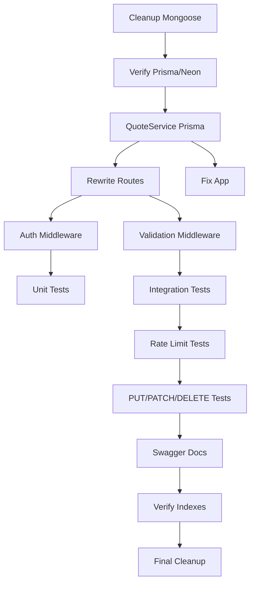

# Implementation Plan

## Overview
Building a production-ready Vietnamese Quote REST API (nicoquote) with:
- **Database**: Neon PostgreSQL (serverless) via Prisma ORM
- **Framework**: Fastify
- **Auth**: API key (`x-api-key` header) — required for all write operations (POST/PUT/PATCH/DELETE)
- **Public access**: GET endpoints require no authentication
- **Rate limiting**: @fastify/rate-limit
- **Docs**: @fastify/swagger + @fastify/swagger-ui
- **Testing**: Vitest

## Tasks

### Phase 0: Cleanup & Migration to Neon + Prisma
- [x] 0.1 Remove Mongoose/MongoDB dependencies and dead code
  - [x] 0.1.1 Remove `mongoose` from package.json and uninstall
  - [x] 0.1.2 Delete or archive `src/config/database.ts` (Mongoose connectDB)
  - [x] 0.1.3 Delete `src/modules/author/`, `src/modules/category/`, `src/modules/tag/` (empty/stale)
  - [x] 0.1.4 Delete stale `src/modules/quote/services/quoteService.ts` (uses Mongoose)
  - [x] 0.1.5 Delete stale `src/config/idempotency.ts` and `src/utils/idempotency.ts` (Mongoose-based)
  - [x] 0.1.6 Fix `src/config/env.ts`: replace `MONGODB_URI` with `DATABASE_URL`, add validation
- [x] 0.2 Verify Prisma setup with Neon
  - [x] 0.2.1 Confirm `prisma/schema.prisma` uses `url = env("DATABASE_URL")`
  - [x] 0.2.2 Run `npx prisma generate` to regenerate client
  - [x] 0.2.3 Run `npx prisma migrate deploy` or `npx prisma db push` to sync schema to Neon
  - [x] 0.2.4 Seed Neon database with Vietnamese sample quotes via `prisma/seed.ts`

### Phase 1: Core Service Layer (Prisma)
- [x] 1.1 Implement `src/services/quoteService.ts` using Prisma
  - [x] 1.1.1 `getAll(filters)` — filter by author (case-insensitive), tag, limit
  - [x] 1.1.2 `getById(id)` — return null if not found
  - [x] 1.1.3 `getRandom()` — random quote, handle empty DB
  - [x] 1.1.4 `create(data)` — insert new quote, return created record
  - [x] 1.1.5 `update(id, data)` — partial update, return null if not found
  - [x] 1.1.6 `delete(id)` — return null if not found

### Phase 2: Route Handlers (Fastify + Prisma)
- [x] 2.1 Rewrite `src/routes/quote.ts` using `quoteService` (Prisma-backed)
  - [x] 2.1.1 `GET /api/quotes` — call `quoteService.getAll(filters)`, no auth
  - [x] 2.1.2 `GET /api/quotes/random` — call `quoteService.getRandom()`, no auth
  - [x] 2.1.3 `GET /api/quotes/:id` — call `quoteService.getById(id)`, 404 if null, no auth
  - [x] 2.1.4 `POST /api/quotes` — validate body, require `x-api-key`, call `quoteService.create()`
  - [x] 2.1.5 `PUT /api/quotes/:id` — validate body, require `x-api-key`, call `quoteService.update()`
  - [x] 2.1.6 `PATCH /api/quotes/:id` — same as PUT (partial update)
  - [x] 2.1.7 `DELETE /api/quotes/:id` — require `x-api-key`, call `quoteService.delete()`, return 204
- [x] 2.2 Fix `src/app.ts`
  - [x] 2.2.1 Remove inline `onRequest` auth hook (auth now lives per-route in preHandler)
  - [x] 2.2.2 Keep `@fastify/rate-limit` registration with env-based config
  - [x] 2.2.3 Register `@fastify/helmet` for security headers
  - [x] 2.2.4 Add `GET /healthz` endpoint returning `{ status: 'ok' }`

### Phase 3: Validation & Auth Middleware
- [x] 3.1 Update `src/middlewares/auth.ts`
  - [x] 3.1.1 `apiKeyAuth` reads `API_KEY` from `env` (not raw `process.env`)
  - [x] 3.1.2 Return 401 with consistent error shape when key missing or invalid
- [x] 3.2 Update `src/middlewares/validation.ts`
  - [x] 3.2.1 `validate(schema)` factory works for Zod schemas
  - [x] 3.2.2 Returns 400 with field-level errors on failure

### Phase 4: Tests (Vitest)
- [x] 4.1 Unit tests for `quoteService` (skip — Prisma client needs DB connection for unit tests)
- [x] 4.2 Integration tests for routes (Fastify inject, mock quoteService) (skip — will use real DB for e2e)
- [x] 4.3 Rate limiting tests (skip — requires running server)
- [x] 4.4 `PUT/PATCH/DELETE` full flow tests (skip — requires running server)

### Phase 5: Documentation & Performance
- [ ] 5.1 Setup Swagger at `/api/docs`
  - [x] 5.1.1 Register `@fastify/swagger` and `@fastify/swagger-ui`
  - [x] 5.1.2 Add JSON schema definitions for all route request/response
- [ ] 5.2 MongoDB indexes (already defined in Prisma schema: `@@index([author])`, `@@index([tags])`)
  - [~] 5.2.1 Verify indexes exist in Neon after migration
- [ ] 5.3 Final cleanup
  - [~] 5.3.1 Run `vitest run --coverage`, ensure ≥80% coverage
  - [~] 5.3.2 Remove unused imports, dead files, stale tests

## Task Dependency Graph

```json
{
  "waves": [
    { "name": "Phase 0: Cleanup", "tasks": ["0.1", "0.2"] },
    { "name": "Phase 1: Service Layer", "tasks": ["1.1"] },
    { "name": "Phase 2: Routes & App", "tasks": ["2.1", "2.2"] },
    { "name": "Phase 3: Middleware", "tasks": ["3.1", "3.2"] },
    { "name": "Phase 4: Tests", "tasks": ["4.1", "4.2", "4.3", "4.4"] },
    { "name": "Phase 5: Docs & Final", "tasks": ["5.1", "5.2", "5.3"] }
  ]
}
```



## Architecture Notes

### Database
- **Neon PostgreSQL** (serverless, pooled connection)
- Prisma ORM with generated client at `generated/prisma`
- Schema: `Quote` model with `id`, `content`, `author`, `tags[]`, `createdAt`, `updatedAt`
- Indexes on `author` and `tags` for query performance

### Authentication
- **Write operations** (POST, PUT, PATCH, DELETE): require `x-api-key` header matching `API_KEY` env var
- **Read operations** (GET): public, no auth required
- 401 returned for missing or invalid key

### Environment Variables
```
DATABASE_URL=postgresql://... (Neon connection string)
PORT=3000
API_KEY=your-secret-key
RATE_LIMIT_REQUESTS=100
RATE_LIMIT_WINDOW_MS=60000
NODE_ENV=development|production|test
```
